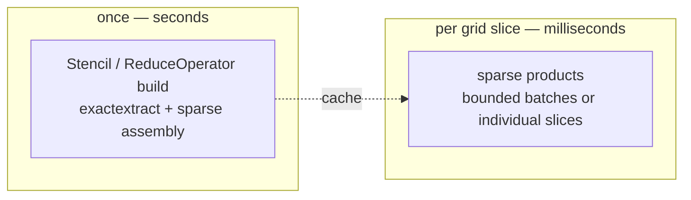

# Performance

The headline claim — *millisecond-scale aggregation in the hot path* — is backed by a
reproducible suite in [`benchmarks/`](https://github.com/campiohe/geohalo/blob/main/benchmarks/run.py).
This page reads the numbers; the [full generated report](benchmark.md) has every row.

```bash
uv run python -m benchmarks.run
```

## The shape of the cost

geohalo deliberately moves all the expensive work into a one-time precompute, leaving a
hot path that applies a precomputed sparse matrix to the grid values.



## Precompute — pay once

Building the [stencil](concepts/stencil.md) scales with polygon count and vertex
complexity; the resulting matrix is small and cacheable.

| n_polygons (GADM Brazil L2) | `Stencil.compute` | CSR size |
| --------------------------- | ----------------- | -------- |
| 50                          | ~21 ms            | 6 KB     |
| 507                         | ~170 ms           | 38 KB    |
| 5571                        | ~2.1 s            | 430 KB   |

After the first build, a [cache](guides/caching.md) hit loads in milliseconds — a
~30–46× speedup for stencils, and **thousands of times** for a refined
[`ReduceOperator`](concepts/reduce-operator.md).

### Detailed polygons: WKB versus GeoJSON

The synthetic benchmark for [#7](https://github.com/campiohe/geohalo/issues/7)
isolates stencil construction with detailed boundaries:

```bash
uv run python -m benchmarks.stencil_build
```

On 3,000 synthetic polygons with 6,003,000 vertices and a global 0.25° grid, a
local run measured these medians over three complete builds:

| Geometry input | Build time |
| --- | ---: |
| Previous GeoJSON path | 15.731 s |
| Current WKB path | 1.079 s |

This was a **14.6× speedup**, with identical CSR matrices, row sums, polygon keys,
and cache digests. Both paths include sorting, geometry serialization,
exactextract coverage, sparse assembly, and hashing; polygon generation is
excluded. The WKB path also reuses its encoded geometries for the digest.

Environment: Python 3.14.4, exactextract 0.3.0, Shapely 2.1.2, NumPy 2.4.6,
SciPy 1.17.1, and GeoPandas 1.1.3. Timings depend on hardware and polygon
complexity; the earlier GADM table uses different polygons and is a separate
historical measurement.

## Hot path — pay per slice

All rows below aggregate to GADM Brazil L2 (~5570 municipalities) on a 0.25° grid over
Brazil (160×160 = 25 600 cells). The batch dims are arbitrary — any stacked non-spatial
dims work; here they follow the ECMWF data the suite happens to use, where `member=50` is
a 50-member ensemble and `step=N` is `N` lead times.

| n_polygons | batch                | slices | factor       | median  |
| ---------- | -------------------- | ------ | ------------ | ------- |
| 50         | (member=50,)         | 50     | 1            | 3.6 ms  |
| 5571       | (member=50,)         | 50     | 1            | 5.8 ms  |
| 5571       | (member=50, step=10) | 500    | 1            | 196 ms  |
| 5571       | (member=50, step=40) | 2 000  | 1            | 670 ms  |
| 5571       | (member=50,)         | 50     | 4 (refined)  | 113 ms  |
| 5571       | (member=50,)         | 50     | 1 (1 % NaN)  | 14 ms   |

A batch of 50 grid slices over 5 571 polygons reduces in **single-digit milliseconds**. The
cost scales with the number of slices, and the
[NaN-aware path](concepts/masked.md) costs roughly 2–3× the clean path for its second
matmul.

## Large-grid application memory

The synthetic benchmark for [#5](https://github.com/campiohe/geohalo/issues/5)
runs without external data:

```bash
uv run python -m benchmarks.operator_memory
```

It compares the previous sort-and-batch implementation with the current
application path on a global 0.25° grid: 24 float32 slices (95.05 MiB), 90 polygons,
and 15,210 matrix coefficients. A local run produced:

| Latitude order | Previous extra peak | Current first-call peak | Current warm peak | Previous median | Current median |
| --- | ---: | ---: | ---: | ---: | ---: |
| Ascending | 285.2 MiB | 0.540 MiB | 0.263 MiB | 78.00 ms | 3.16 ms |
| Descending | 475.3 MiB | 0.545 MiB | 0.326 MiB | 134.26 ms | 2.56 ms |

Results were identical in this run, retaining float64 arithmetic. Peaks are
`tracemalloc` allocations during application, including output and any first-call
preparation, but excluding the already allocated input and canonical matrix.
They are not total process RSS. Timings are warmed medians of five calls and vary
by hardware. The benchmark checks results against the previous product at
`rtol=1e-12` and `atol=1e-12`.

## The fusion win

For a 0.25° → 0.05° refine (~3.2 M target cells) over 500 polygons, the materialised
[resampler](concepts/downscaling.md) is a 358 MB blob that **cannot build at all** at
`iterations=3`. The [fused `ReduceOperator`](concepts/reduce-operator.md) is a **0.40 MB**
blob, builds in ~0.5 s, and loads in ~0.5 ms — same answer, ~900× smaller.

<figure markdown>
{ width="720" }
</figure>

## Chunk-aware reads

[`RestrictedOperator`](concepts/restricted-operator.md) addresses the remaining
full-grid I/O cost for clean lazy inputs. The synthetic
[#6](https://github.com/campiohe/geohalo/issues/6) benchmark uses a local in-memory
Zarr v3 store and counts actual data-chunk reads:

```bash
uv run python -m benchmarks.chunk_reads
```

For 24 float32 steps on a descending 721 × 1440 grid, 15 polygons in two distant
regions, and storage chunks of 6 × 64 × 64, a local run measured:

| Path | Data-chunk reads | Compressed payload read | Extra allocation peak | Median time |
| --- | ---: | ---: | ---: | ---: |
| Full-grid `reduce_with_operator` | 1,104 | 84.747 MiB | 98.388 MiB | 1.0690 s |
| `reduce_with_restricted_operator` | 12 | 1.003 MiB | 0.467 MiB | 0.0277 s |

The plan reads two disjoint windows covering 12,288 of 1,038,240 spatial cells
(1.18%). Every fetched data chunk was read once, and outputs matched exactly in
this run. The benchmark asserts agreement at `rtol=1e-12`, `atol=1e-12`.

Times are medians of three uninstrumented applications; the extra peak is from
a separate `tracemalloc` run, not total process RSS. Data generation, store
creation, coordinate loading, and operator construction are excluded. This is
local decoding and reduction, **not** a cloud latency measurement. Physical I/O
also depends on storage chunking, sharding, and any upstream Dask transformations.

Environment: Python 3.14.4, xarray 2026.4.0, Zarr 3.4.0, NumPy 2.4.6, SciPy 1.17.1,
Intel Core Ultra 5 125H in a Linux virtual machine. The application uses Zarr
without Dask here; tests also count actual reads through Dask-backed Zarr and
irregular Dask chunks.

## Rollups

[Hierarchical rollups](concepts/bias-tree.md) are another matmul. The full GADM Brazil
muni → state hierarchy (5 571 leaves) rolls a batch of 50 slices up in ~5.6 ms; with a
500-slice batch, ~19 ms.

### Tree construction

The synthetic benchmark for [#8](https://github.com/campiohe/geohalo/issues/8)
compares the previous row-by-row builder with the depth-bounded sparse builder:

```bash
uv run python -m benchmarks.bias_tree_build
uv run python -m benchmarks.bias_tree_build --leaves 5570 --fanout 10
uv run python -m benchmarks.bias_tree_build --leaves 20000 --fanout 10 --repeats 1
```

Local measurements of complete builds, including validation, ordering, matrix
assembly, and hashing (but excluding synthetic hierarchy generation). The first
two tree sizes use medians of three builds; the largest uses one build per mode:

| Leaves | Internal nodes | Mode | Previous build | Sparse build |
| ---: | ---: | --- | ---: | ---: |
| 2,862 | 25 | weighted mean | 1.015 s | 0.022 s |
| 2,862 | 25 | weighted sum | 1.092 s | 0.013 s |
| 5,573 | 620 | weighted mean | 2.905 s | 0.055 s |
| 5,573 | 620 | weighted sum | 3.201 s | 0.034 s |
| 20,003 | 2,223 | weighted mean | 30.307 s | 0.194 s |
| 20,003 | 2,223 | weighted sum | 29.787 s | 0.142 s |

The benchmark checks exact equality of CSR coefficients, indices, row pointers,
node keys, and cache digests for both modes. Each hierarchy includes three leaves
attached directly to the root, exercising unequal leaf depths. Build cost depends
on depth and the number of contributing leaf–ancestor pairs, not just leaf count.

Environment: Python 3.14.4, NumPy 2.4.6, pandas 3.0.3, SciPy 1.17.1, Intel Core
Ultra 5 125H in a Linux virtual machine. Timings vary with machine load; these are
synthetic build measurements, separate from the historical GADM hot-path timings.

## Caveats

Numbers are point-in-time on the author's machine and vary ±20 % by hardware. Cold-import
overhead (~0.3 s for `import geohalo`) is excluded — the suite measures steady-state cost.
The [full report](benchmark.md) is regenerated after any perf-relevant change and
records the exact environment, hardware, and methodology.
